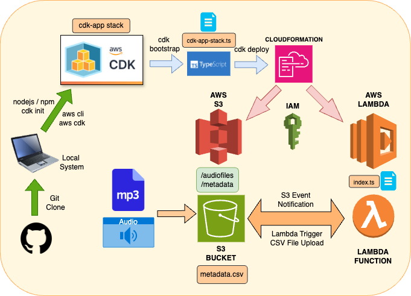

# **AWS CDK Application: Audio File Metadata Extraction**

This AWS CDK application automates the processing of audio files uploaded to an S3 bucket. When an audio file is uploaded, the application extracts metadata (e.g., file name, upload timestamp, and client ID), appends it to a `metadata.csv` file in the same S3 bucket, and supports querying metadata records programmatically.

---

## **Architecture**
The architecture for this AWS CDK Application is shown below:



This project uses the following AWS services:
1. **Amazon S3**:
   - S3 Bucket stores uploaded audio files.
   - Stores the `metadata.csv` file for metadata aggregation.
2. **AWS Lambda**:
   - Processes S3 events triggered by file uploads.
   - Extracts and appends metadata to the CSV file.
3. **IAM**:
   - Enforces least-privilege access for Lambda to interact with the S3 bucket.
4. **AWS CDK**:
   - Provisions the infrastructure and automates deployment.

---

## **Key Considerations**
### 1. **Production-Grade Standards**
This solution has been implemented with production-grade standards in mind:
- **Scalability**: The architecture uses AWS Lambda, which automatically scales to handle concurrent uploads.
- **Resilience**: The S3 bucket and Lambda function leverage highly available AWS-managed services.
- **Security**:
  - Fine-grained IAM roles restrict access to the necessary resources.
  - Bucket policies ensure least-privilege access to the S3 bucket.
- **Code Quality**: The Lambda function is written in TypeScript, ensuring strong typing and maintainability.
- **Logging & Debugging**:
  - The Lambda function logs key events and errors to Amazon CloudWatch for monitoring and troubleshooting.
  - Structured logs help in debugging and operational insight.

### 2. **Leveraging AWS CDK Inbuilt Features**
This project avoids reinventing the wheel by fully utilizing AWS CDK's capabilities:
- **Resource Provisioning**: AWS CDK provisions all required AWS resources natively, such as:
  - S3 bucket
  - Lambda function
  - Event source mapping between S3 and Lambda
  - IAM roles and policies
- **Deployments**: Uses CDK's seamless deployment process (`cdk deploy`) to create and update resources without manual intervention.
- **Code Bundling**: AWS CDK automatically handles Lambda function asset bundling.
- **Environment Bootstrapping**: CDK simplifies bootstrapping for permissions required by the deployment process.


---

## **Prerequisites**
### Local System
1. **Node.js**:
   ```bash
   brew install node
   ```
   Verify installation:
   ```bash
   node -v
   npm -v
   ```

2. **AWS CLI**:
   Install AWS CLI:
   ```bash
   brew install awscli
   ```
   Configure AWS CLI:
   ```bash
   aws configure
   ```

3. **AWS CDK**:
   Install AWS CDK globally:
   ```bash
   npm install -g aws-cdk
   ```
   Verify installation:
   ```bash
   cdk --version
   ```
   initialize the application
   ```bash
   cdk init app --language typescript
   ```
   verify it works correctly
   ```bash
   cdk ls
   ```
   copy the content of cdk-app-stack.js into lib/cdk-app-stack.js
   (use a file editor vi or nano to do that)

   
   setup the Lambda function
   ```bash
   mkdir lambda && cd lambda
   touch index.ts
   ```

4. **AWS Account**:
   Ensure you have access to an AWS account with permissions to create S3, Lambda, and IAM resources.

---

## **Project Setup**
1. Clone the repository:
   ```bash
   git clone <your-repo-url>
   cd cdk-app
   ```

2. Install dependencies:
   ```bash
   npm install
   ```

3. Build the project:
   ```bash
   npm run build
   ```

---

## **Bootstrapping the Environment**
Before deploying the stack, bootstrap your AWS environment (only required once per region):
```bash
cdk bootstrap aws://<AWS_ACCOUNT_ID>/<AWS_REGION>
```
Replace `<AWS_ACCOUNT_ID>` and `<AWS_REGION>` with your account ID and preferred region (e.g., `us-east-1`).

(Optional) synthesize as a CloudFormation template:
```bash
cdk synth
```
---

## **Deploying the Application**
To deploy the stack:
```bash
cdk deploy
```

This command provisions the following AWS resources:
- An S3 bucket and its folders "audiofiles" and "metadata" for storing audio files and the `metadata.csv`.
- A Lambda function triggered by S3 events to process uploaded audio files.
- Necessary IAM roles and policies.

---

## **Using the Application**
1. **Upload an Audio File**:
   - Upload manualy an audio file (e.g., `audiofiles/client1/YYYY/MM/DD/example.mp3`) to the designated folder in the S3 bucket.

2. **View the Metadata**:
   - The metadata of the uploaded file is appended to `metadata.csv` in the `metadata/` folder of the same S3 bucket.

3. **Query Metadata**:
   - Query the `metadata.csv` programmatically (e.g., retrieve all rows for `ClientID = 'client1'`).

---

## **AWS CDK Features Used**
### Inbuilt CDK Features Leveraged:
- **Automatic IAM Role Creation**:
  - CDK creates IAM roles with the least-privilege access for Lambda to interact with S3.
- **Lambda Event Source Mapping**:
  - The event source mapping between S3 and Lambda is natively handled by CDK.
- **Asset Management**:
  - CDK automatically packages and uploads the Lambda function code as an S3 asset.
- **Built-In Logging**:
  - Lambda function logs are automatically streamed to CloudWatch.
- **Dependency Management**:
  - The `@aws-cdk/aws-lambda` and `@aws-cdk/aws-s3` modules simplify resource definitions.

---

## **Production-Grade Enhancements**
To further ensure production-grade quality, consider the following actions:
1. **Monitoring and Alerts**:
   - Use AWS CloudWatch Alarms to monitor Lambda function errors and S3 access patterns.
   - Set up SNS notifications for critical alerts.

2. **Data Lifecycle Management**:
   - Configure S3 lifecycle rules to move older `metadata.csv` files to cheaper storage classes (e.g., Glacier).

3. **Versioning and Backups**:
   - Enable versioning on the S3 bucket to protect against accidental deletions or overwrites.

4. **Security Enhancements**:
   - Enable server-side encryption for the S3 bucket (e.g., AES-256 or KMS-managed keys).
   - Use CDK to provision an S3 bucket policy that enforces encryption.

5. **Code Quality and Testing**:
   - Add unit tests for the Lambda function using a framework like Jest or Mocha.
   - Validate the CDK stack using `cdk synth` and `cdk diff` before deploying.

---

## **Commands Used**
### **Setup**
- Install Node.js: `brew install node`
- Install AWS CLI: `brew install awscli`
- Install AWS CDK: `npm install -g aws-cdk`

### **Run Locally**
- Install dependencies: `npm install`
- Build the project: `npm run build`

### **AWS CDK Commands**
- Bootstrap the environment:
   ```bash
   cdk bootstrap aws://<AWS_ACCOUNT_ID>/<AWS_REGION>
   ```
- Deploy the stack:
   ```bash
   cdk deploy
   ```
- Destroy the stack:
   ```bash
   cdk destroy
   ```

---

## **Cleaning Up Resources**
To delete all resources created by the stack:
```bash
cdk destroy
```
